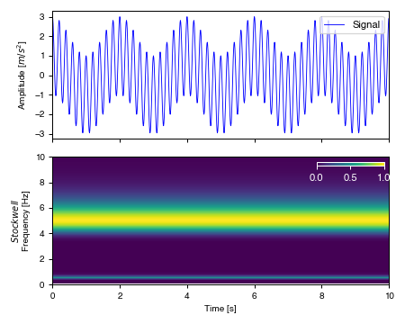

.. image:: https://travis-ci.org/eng-tools/eqsig.svg?branch=master
   :target: https://travis-ci.org/eng-tools/eqsig
   :alt: Testing Status

.. image:: https://img.shields.io/pypi/v/eqsig.svg
   :target: https://pypi.python.org/pypi/eqsig
   :alt: PyPi version

.. image:: https://coveralls.io/repos/github/eng-tools/eqsig/badge.svg
   :target: https://coveralls.io/github/eng-tools/eqsig

.. image:: https://img.shields.io/badge/license-MIT-blue.svg
    :target: https://github.com/eng-tools/eqsig/blob/master/LICENSE
    :alt: License

.. image:: https://eng-tools.github.io/static/img/ecp-badge.svg
    :target: https://eng-tools.github.io
    :alt: ECP project

.. image:: https://zenodo.org/badge/125842866.svg
   :target: https://zenodo.org/badge/latestdoi/125842866
   :alt: DOI

.. image:: https://pepy.tech/badge/eqsig
   :target: https://pepy.tech/project/eqsig

*****
eqsig
*****

A Python package for seismic signal processing.

Features
========

This package provides common functions for computing ground motion parameters and performing signal processing.
The functions are implemented on either numpy arrays or on a signal object that uses caching to avoid expensive
recalculation of widely used parameters.

* Compute the acceleration response spectrum and elastic response time series using the fast Nigam and Jennings (1968) algorithm.
* Compute the Fourier amplitude spectrum (using the scipy.signal.fft algorithm)
* Compute the smooth Fourier amplitude spectrum according to Konno and Ohmachi (1998)
* Compute velocity and displacement from acceleration time series
* Compute peak ground motion quantities (PGA, PGV, PGD)
* Compute common ground motion intensity measures (Arias intensity, CAV, CAV_dp5, significant duration, bracketed duration, dominant period)
* Compute signal features (zero crossings, global peaks, local peaks)
* Compute rotated ground motion or intensity measure from two ground motion components
* Resampling of ground motion through interpolation or periodic resampling
* Butterworth filter (using scipy), running average, polynomial fitting
* Fast loading of, and saving of, plain text to and from Signal objects

How to Use
==========

[Eqsig documentation](https://eqsig.readthedocs.io)

Examples
--------

Generate response spectra
_________________________

.. code-block:: python

    import numpy as np
    import matplotlib.pyplot as plt
    import eqsig.single

    bf, sub_fig = plt.subplots()
    a = np.loadtxt("<path-to-acceleration-time-series>")
    dt = 0.005  # time step of acceleration time series
    periods = np.linspace(0.2, 5, 100)  # compute the response for 100 periods between T=0.2s and 5.0s
    record = eqsig.AccSignal(a * 9.8, dt)
    record.generate_response_spectrum(response_times=periods)
    times = record.response_times

    sub_fig.plot(times, record.s_a, label="eqsig")
    plt.show()

Generate Stockwell transform
____________________________

.. code-block:: python

    import numpy as np
    import matplotlib.pyplot as plt
    import eqsig

    from matplotlib import rc
    rc('font', family='Helvetica', size=9, weight='light')
    plt.rcParams['pdf.fonttype'] = 42

    dt = 0.01
    time = np.arange(0, 10, dt)
    f1 = 0.5
    factor = 10.
    f2 = f1 * factor
    acc = np.cos(2 * np.pi * time * f1) + factor / 5 * np.cos(2 * np.pi * time * f2)

    asig = eqsig.AccSignal(acc, dt)

    asig.swtf = eqsig.stockwell.transform(asig.values)

    bf, ax = plt.subplots(nrows=2, sharex=True, figsize=(5.0, 4.0))

    ax[0].plot(asig.time, asig.values, lw=0.7, c='b', label='Signal')

    in_pcm = eqsig.stockwell.plot_stock(ax[1], asig)
    ax[1].set_ylim([0.0, 10])
    ax[0].set_xlim([0, 10])

    ax[0].set_ylabel('Amplitude [$m/s^2$]', fontsize=8)
    ax[1].set_ylabel('$\it{Stockwell}$\nFrequency [Hz]', fontsize=8)
    ax[-1].set_xlabel('Time [s]', fontsize=8)

    from mpl_toolkits.axes_grid1.inset_locator import inset_axes
    cbaxes = inset_axes(ax[1], width="20%", height="3%", loc='upper right')
    cbaxes.set_facecolor([1, 1, 1])
    cb = plt.colorbar(in_pcm, cax=cbaxes, orientation='horizontal')
    cb.outline.set_edgecolor('white')
    cbaxes.tick_params(axis='both', colors='white')

    ax[0].legend(loc='upper right')
    for sp in ax:
        sp.tick_params(axis='both', which='major', labelsize=8)

    plt.tight_layout()
    plt.show()

Useful material
===============

*

Contributing
============

How do I get set up?
--------------------

1. Run ``pip install -r requirements.txt``

Package conventions
-------------------

* A function that calculates a property that takes a Signal object as an input, should be named as `calc_<property>`,
  if the calculation has multiple different implementations, then include the citation as author and year
  as well `calc_<property>_<author>_<year>`
* If the function takes a raw array then it should contain the word array (or values or vals).

Testing
-------

Tests are run with pytest

* Locally run: ``pytest`` on the command line.

* Tests are run on every push using travis, see the ``.travis.yml`` file

Deployment
----------

To deploy the package to pypi.com you need to:

1. Push to the *pypi* branch. This executes the tests on circleci.com

2. Create a git tag and push to github, run: ``trigger_deploy.py`` or manually:

.. code:: bash

    git tag 0.5.2 -m "version 0.5.2"
    git push --tags origin pypi

Documentation
-------------

Built via Sphinx following: https://codeandchaos.wordpress.com/2012/07/30/sphinx-autodoc-tutorial-for-dummies/

For development mode

 1. cd to docs
 2. Run ``make html``

Docstrings follow numpy convention (in progress): https://numpydoc.readthedocs.io/en/latest/format.html

To fix long_description in setup.py: ``pip install collective.checkdocs``, ``python setup.py checkdocs``

Release instructions
--------------------

On zenodo.org use the github integration tool, click on the eqsig package and click create new release.